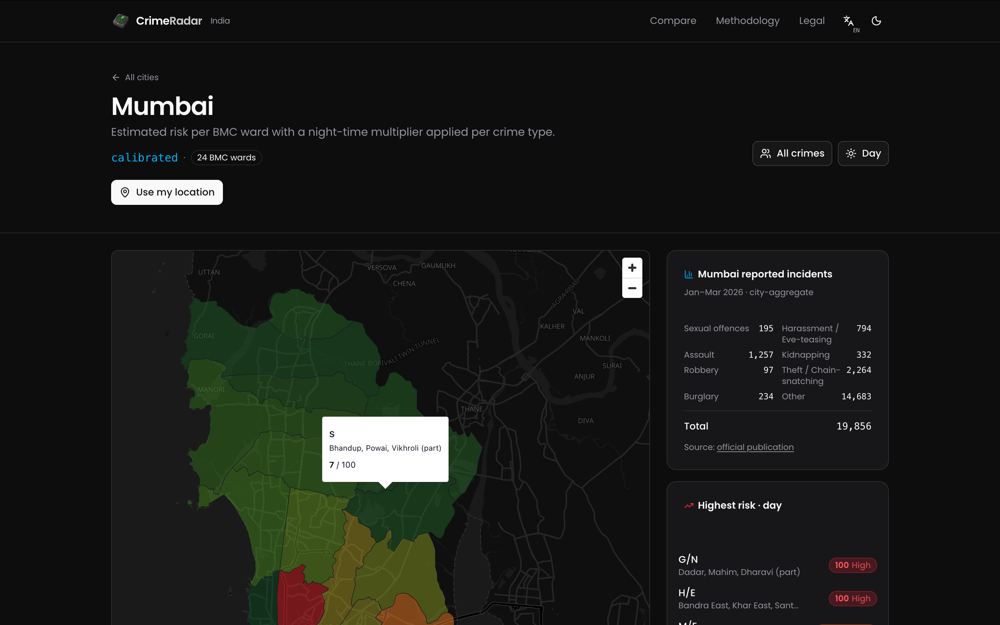
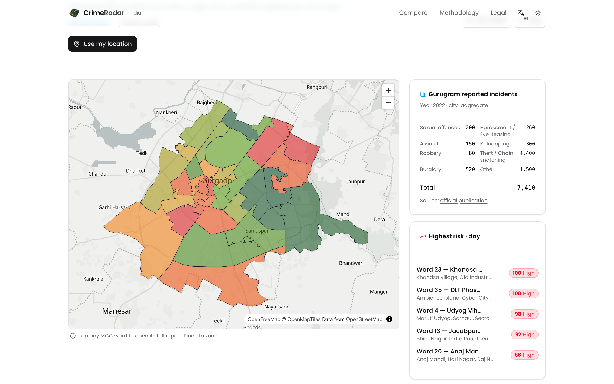
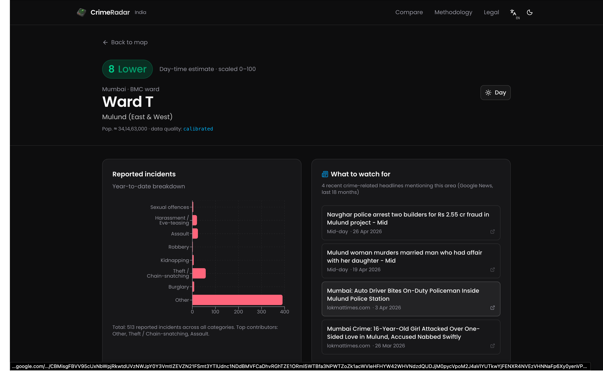
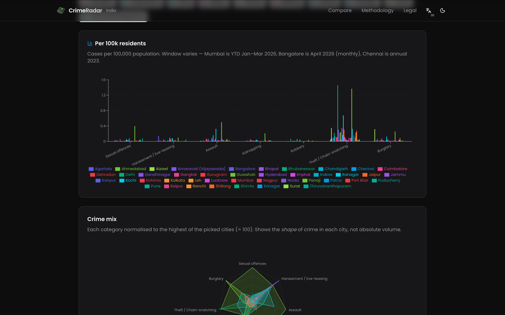
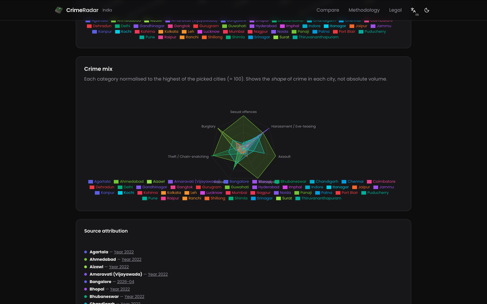
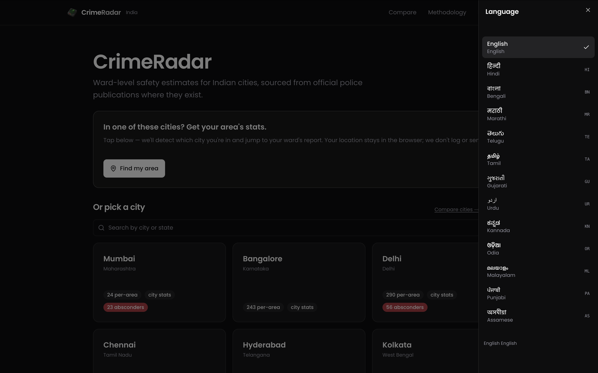
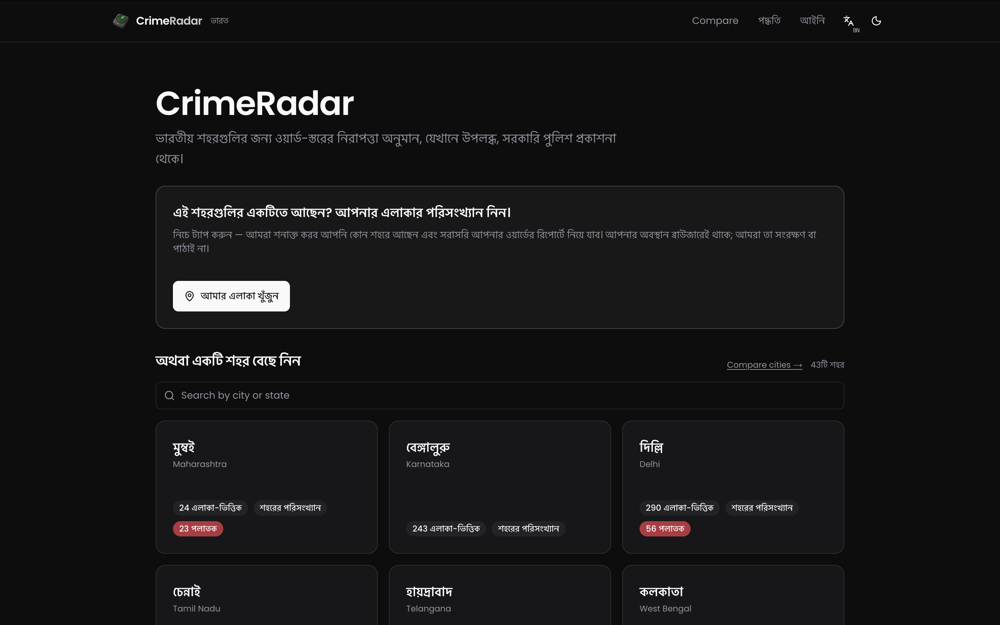

# CrimeRadar

Ward-level safety map for Indian cities. **43 cities across 28 states + 6 UTs**,
in 13 languages. Per-ward risk scores derived from real city-aggregate crime
statistics (NCRB / state-police annual reports), with a night-time multiplier
and a women's-safety filter. Five cities (Mumbai, Delhi, Kolkata, Pune,
Gurugram) also republish the official police Absconder / Proclaimed Offender
list with attribution.

Live at <https://eeman1113.github.io/crimeradar/>.



## Screenshots

### Ward heatmap with night-time multiplier
Per-area risk shaded against a real city-aggregate total, with night-mode and women's-safety toggles, a "use my location" jump, and a side panel listing the highest-risk wards.

<table>
  <tr>
    <td width="50%"><br/><sub><b>Mumbai</b> · dark theme · BMC 24 wards · calibrated to YTD Jan–Mar 2026</sub></td>
    <td width="50%"><br/><sub><b>Gurugram</b> · light theme · MCG ward heatmap · 2022 annual</sub></td>
  </tr>
</table>

### Ward detail
Drill into any ward for the YTD category breakdown, the per-1,000-resident rate, and recent crime-related news headlines (last 18 months, Google News RSS, keyword-filtered).



### Compare cities
All 43 cities side-by-side. Bar chart normalises to **cases per 100,000 residents** so big metros don't drown out smaller capitals; the radar chart shows the **shape** of crime (theft-heavy vs assault-heavy vs sexual-offence-heavy) regardless of volume.

<table>
  <tr>
    <td width="50%"><br/><sub>Per-100k rates across all 43 cities, each year-window stamped</sub></td>
    <td width="50%"><br/><sub>Crime-mix radar — each category normalised to the highest city = 100</sub></td>
  </tr>
</table>

### 13 languages
City names, UI strings, and number formats localise to any of 13 Indian languages. City names come from Wikipedia interlanguage links; UI from a hand-maintained dictionary.

<table>
  <tr>
    <td width="50%"><br/><sub>Language picker — English + 12 Indic locales</sub></td>
    <td width="50%"><br/><sub>Home page in বাংলা — city tiles re-render in script</sub></td>
  </tr>
</table>

## Data sources

- **Ward boundaries** — sourced per-city from datameet / datta07 /
  ESRI India Living Atlas / OSM Overpass / official municipal GIS portals.
- **City-wide crime totals (43 cities)** — NCRB "Crime in India 2022"
  (megacities + District-wise Additional Tables), NCRB 2023 expanded
  34-city table, plus state-police annual reports / commissionerate PDFs
  for capitals. See `data/cities/<id>/monthly_stats.json` for each city's
  source URL + year.
- **Per-ward populations (26 of 43 cities)** — Census 2011 (or the city's
  own published voter/ward demographics where they predate Census). The
  remaining 17 cities have post-2011 ward delimitations that don't map
  1-to-1 to Census ward IDs; they use an even-split estimate over the
  total city population until a spatial join is built.
- **Per-ward risk distribution** — apportioned from each city's real
  city-wide totals using a tier model (central, inner, outer, peripheral
  bands derived from each ward's distance to the city centroid). The
  `calibrate()` step in `lib/wards.ts` then rescales every ward so the
  category sums match the real city number. The data-quality badge on
  each city card reads "calibrated" when this real-sum match is in
  effect.
- **News headlines per ward** — Google News RSS, keyword-filtered for
  crime/police/arrest terms, ≤4 items per ward, refreshed weekly.
- **Localized city names (12 Indic languages)** — Wikipedia interlanguage
  links. Average coverage 11/12 across 43 cities.

## Stack

Next.js 16 (App Router) static export · TypeScript · Tailwind v4 ·
MapLibre GL JS · Recharts · GitHub Pages.

## Architecture

The city registry is **manifest-driven** — `data/cities.manifest.json` is the
single source of truth. `scripts/codegen_cities.mjs` runs as a `prebuild`
hook and emits three generated files (`lib/cities.generated.ts`,
`lib/wards.generated.ts`, `lib/absconders.generated.ts`). Adding a city is
one manifest row + a GeoJSON file in `public/geo/`.

Per-city data lives under `data/cities/<id>/`:

```
data/cities/mumbai/
  wards-raw.ts             per-ward seed (id, name, population, breakdown)
  monthly_stats.json       city-wide annual/YTD totals from the official source
  monthly_stats_history.json  multi-year history where available
  ward_news.json           Google News RSS items per ward
  absconders.json          police absconder list (5 cities only)
```

## Onboarding a new city

```bash
# Drop the ward GeoJSON in public/geo/<id>_wards.geojson, then:
node scripts/add_city.mjs \
  --id <id> --name "<Name>" --state "<State>" --state-code IN-XX \
  --tier capital --geojson public/geo/<id>_wards.geojson \
  --ward-id-key <propertyName> --unit "<MC ward>" \
  --population <city_total> \
  [--population-key <perWardPopProperty>]  # if GeoJSON has it
```

The script validates the GeoJSON, registers the city in the manifest, stubs
the four data JSON files, generates the ward seed, and re-runs codegen.

## Local dev

```bash
npm install
npm run dev        # auto-codegens via prebuild, then next dev
```

Open <http://localhost:3000>.

## Data refresh

Three GitHub Actions workflows keep the data fresh:

| Workflow | Cadence | What |
|---|---|---|
| `ingest_news.yml` | Sunday 04:00 UTC | Google News RSS per ward for every city in the manifest |
| `ingest_stats.yml` | 1st of month 03:00 UTC | Mumbai / Bangalore / Chennai / Delhi monthly scrapers + optional NCRB CSV ingest via `workflow_dispatch` |
| `ingest.yml` | Monday 02:30 UTC | Absconder lists (5 cities) |
| `deploy.yml` | Every push to `main` | `next build` static export → GitHub Pages |

Manual trigger:

```bash
gh workflow run ingest_news.yml
gh workflow run ingest_stats.yml -f ncrb_csv_url=https://... -f ncrb_year=2023
```

## Onboarding the NCRB megacity stats

```bash
# Once you have the megacity table as CSV (City, Crime Head, Cases):
node scripts/ingest_ncrb.mjs --csv ncrb_megacities.csv --year 2022
```

Aliases for state-capital names are wired into the same pipeline, so
state-police CSVs in the same shape ingest the same way.

## i18n

13 locales supported (en + 12 Indic). UI strings live in
`lib/i18n/strings.ts`; city names come from `nameI18n` per city in the
manifest (populated via `scripts/fetch_city_names.mjs` from Wikipedia
langlinks). `useI18n()` exposes both `t(key)` and `cityName(id)`.

## Disclaimers

Risk scores are **estimates**, not safety guarantees. See `/methodology`
for the exact formula, every data source, and known limitations per
city. See `/legal` for the naming policy (absconders are only on this
site because the police themselves published the names), takedown
contact, and DPDP notice.

## License

This project is licensed under the GNU Affero General Public License v3.0 — see [LICENSE](./LICENSE).
